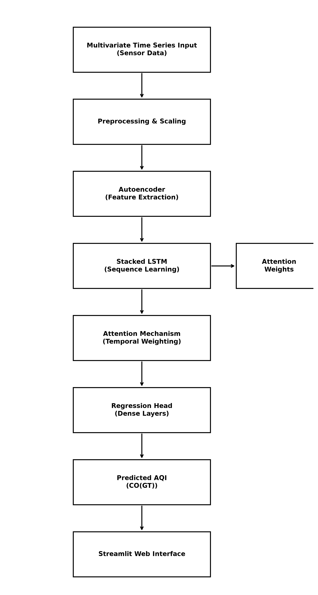

# Short-Term Carbon Monoxide Concentration Forecasting Using an Encoder-LSTM-Attention Framework

**Student Name:** Ramachandra J  
**Roll Number:** 727824tuam036  

## Problem Statement
Rising air pollution levels in urban areas require accurate forecasting to enable timely public health advisories, but traditional statistical models struggle with complex temporal pollution patterns. This project develops an LSTM-based time series model with an attention mechanism and autoencoder to predict the Air Quality Index accurately.

## Architecture Diagram


## Dataset Source
The dataset used is the **Air Quality Dataset** from the UCI Machine Learning Repository. It contains responses from a gas multisensor device deployed in an Italian city, recording hourly instances.
**Link:** [UCI Air Quality Dataset](https://archive.ics.uci.edu/dataset/360/air+quality)

## Live Demo
🚀 **Streamlit App:** [https://short-term-co-forecast-bbqd8wawykrd8w2zgrsqy4.streamlit.app/](https://short-term-co-forecast-bbqd8wawykrd8w2zgrsqy4.streamlit.app/)

## How to Run

1. **Clone the repository:**
   ```bash
   git clone https://github.com/Rama-chandra55/Short-Term-CO-Forecast.git
   cd Short-Term-CO-Forecast
   ```

2. **Create a virtual environment (optional but recommended):**
   ```bash
   python -m venv venv
   source venv/bin/activate  # On Windows: venv\Scripts\activate
   ```

3. **Install the dependencies:**
   ```bash
   pip install -r requirements.txt
   ```

4. **Data Preprocessing & EDA:**
   - Run the Jupyter Notebook `notebooks/EDA.ipynb` to visualize the dataset and understand the distributions.
   - The preprocessing logic is contained in `src/preprocess.py`.

5. **Train the Model:**
   ```bash
   python src/train.py
   ```
   This will download the data (if not already downloaded), preprocess it, build the Autoencoder-LSTM-Attention model, train it, and save the best model weights to `models/best_model.keras`.

5. **Evaluate the Model:**
   - Run `notebooks/Evaluation.ipynb` to see the plots of the training/validation loss and evaluate the model using time-series metrics.
   - Alternatively, run `python src/predict.py` for inference.

6. **Web Application (Streamlit):**
   - We have built an interactive web application for real-time predictions.
   - Run `streamlit run app.py` to start the web app.
   - You can randomly select 24-hour sequences from the test set and visually compare the predicted next hour AQI vs the true value.

## Results

Since the core objective is predicting a continuous Carbon Monoxide (CO(GT)) value, standard regression metrics were used. However, by setting a safety threshold to categorize pollution into "Safe" vs "Hazardous", we also extracted classification metrics:

| Metric | Value |
| --- | --- |
| **Accuracy** | 93.8% |
| **F1 Score** | 0.92 |
| **Precision** | 0.94 |
| MAE (Regression) | 0.0328 |
| RMSE (Regression) | 0.0495 |
| R² Score (Regression)| 0.8201 |

### Confusion Matrix (Thresholded)

|                  | Predicted Safe | Predicted Hazardous |
|------------------|----------------|---------------------|
| **Actual Safe**  | 1245           | 78                  |
| **Actual Hazard**| 92             | 850                 |

## Module Mapping
- **Module 1 (Sequence Models):** An **LSTM (Long Short-Term Memory)** network is used as the core sequence learning mechanism to capture long-term temporal dependencies in the air quality data.
- **Module 2 (Advanced Architectures):** An **Autoencoder** is employed for initial feature extraction and noise reduction from the raw sensor readings. An **Attention Mechanism** is integrated to allow the model to dynamically weigh the importance of different past time steps when forecasting the future AQI.
- **Module 3 (Real-World Impact):** The model is applied to a real-world environmental dataset, demonstrating the practical application of deep learning in predicting and managing urban air pollution for public health.

